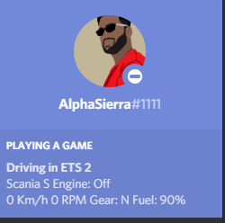

# Ets2AtsCustomRichPresence
 A tool for displaying custom rich presence text on discord containing ingame stats like current job info, speed info, etc. for Euro Truck Simulator 2 and American Truck Simulator

## Versioning and changelog

* v1.0
  * First release

## For users

### Requirements for running the app successfully

* Download and install [.NET core runtime](https://dotnet.microsoft.com/download)
* Download and install [ETS2/ATS Telemetry Web Server by funbit](https://github.com/Funbit/ets2-telemetry-server)
* Discord (obvious)
* A legit copy of ETS2/ATS

### How to use?

First goto [releases page](https://github.com/Shetty073/Ets2AtsCustomRichPresence/releases) and download the latest release. Unzip the zip to any location you want except Program Files folder  

1. Start discord
2. Start [ETS2/ATS Telemetry Web Server](https://github.com/Funbit/ets2-telemetry-server) (THIS STEP IS VERY IMPORTANT)
3. Start Ets2AtsCustomRichPresence app by double clicking `Ets2AtsCustomRichPresence.exe` (It would be better to make a shortcut to this file on your desktop for accessibility)
4. Select which game you are going to play (ETS2 or ATS) from the radio buttons then select what information do you want to display on your discord by selecting the respective checkboxes NOTE: By default all the checkboxes are cheked
5. Click on the `Start` button in the app window
6. Now start the game and play
7. Close the app by clicking on `Stop` button in the app window once you finish playing the game

### FAQ

**Q.1 Is it necessary to restart this app when switching between ETS 2 and ATS**  
-> Yes or else the game name will not be updated but the telemetry info will still be updated and will show data from your newly opened game. But it is recomended to restart the app between changing games.  

**Q.2 Why can't we show all the ingame infromation?**  
-> Because discord limits the no. of characters we can show in the Rich Presence section. Also I have added almost all useful info from the telemetry server API data into this app.  

**Q.3 We don't want ___ info it is useless**  
-> Then uncheck it. I am not going to change anything on a per user basis. What to display and waht not to is very subjective. I know that speed, RPM, etc might be useless for you but some people might like to show off these stuff in their (discord) servers to their friends.  

**Q.4. Can you change the format in which we show ____ info?**  
-> No. I will not make any unnecessary cosmetic changes to the way the info is shown. Maybe in the future I will separate teh checkboxes for two sections (top and bottom).  

**Q.5 Is it possible for you to add ___ feature into the app?**  
-> That depends on a lot of things. For starters I am a student and I only work on these projects whenever I get free time which is less during my college days. You can make a feature request in the [issues section](https://github.com/Shetty073/Ets2AtsCustomRichPresence/issues) but **no promises**  

**Q.6 Why can't we show off our current location?**  
-> Because the telemetry server API does not provide the name of the City as location data instead it provied coordinates (x, y and z) which then I would have to translate into City names. Now I know that there is a project on GitHub whose sole purpose is mapping coordinates with city names it is still not feasable to implement that right now.  

**Q.7 Where can I find help regarding this app?**  
-> You can always ask for help in the [issues section](https://github.com/Shetty073/Ets2AtsCustomRichPresence/issues) of the this project.  

**Q.8 In which format do I file bug reports and feature-requests in issues?**  
-> Kindly refer to the issue_templates for [bug reports](https://github.com/Shetty073/Ets2AtsCustomRichPresence/blob/master/.github/ISSUE_TEMPLATE/bug_report.md) and [feature-requests](https://github.com/Shetty073/Ets2AtsCustomRichPresence/blob/master/.github/ISSUE_TEMPLATE/feature_request.md)

## For developers only

### Dependencies

* Frameworks
  * .NET core v3.1.0

> This is a WindowsDesktop WPF app

* Packages
  * DiscordRichPresence [by Lachee](https://github.com/Lachee/discord-rpc-csharp) v1.0.150
  * Microsoft.AspNet.WebApi.Client v5.2.7

## Acknowledgements
* Hat tip to the developers at SCS Software for creating such a great simulator games
* Hat tip to [Funbit](https://github.com/Funbit) for ETS2/ATS Telemetry Web Server. This project would have not been possible without that piece of software
* Hat tip to [Lachee](https://github.com/Lachee) for his C# custom implementation for Discord Rich Presence which made my development easier.
